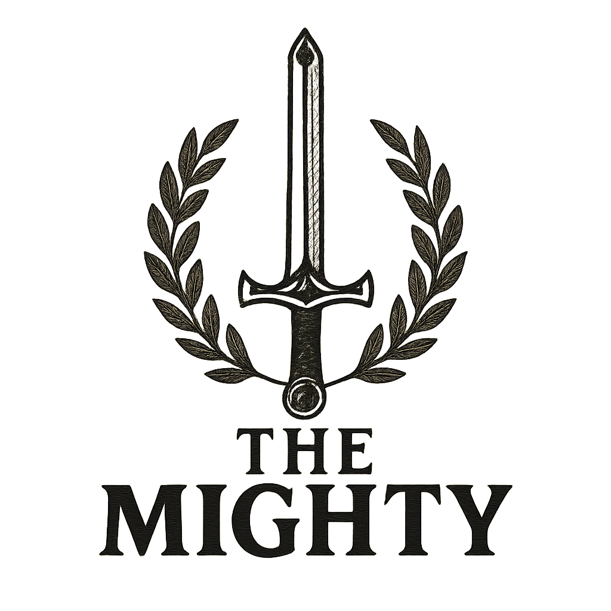

# 🛡️ Combat Arena: Rise of the Mighty

<p align="center">
  
</p>


A modular Python battle simulator with critical hits, level progression, and persistent saves.

## 🚀 Features

- 🎲 Dice-based combat system with RNG critical hits
- ⚔️ Modular architecture (Fighter, BattleModule, Utils, Save, Config)
- 📈 Dynamic XP system with auto-scaling levels
- 💾 JSON persistence for game state
- 🔧 Clean imports and type hints

## 📦 Prerequisites

- Python 3.9+
- No external dependencies

## ⚙️ Installation

```bash
git clone https://github.com/yourusername/combat-arena.git
cd combat-arena
```

## 🏁 Getting Started

```bash
python main.py
```

Modify `fighters.json` to customize enemies:
```json
{
  "enemies": [
    {
      "name": "Goblin",
      "health": 15,
      "attack": 4
    }
  ]
}
```

## 📂 Project Structure

```
combat-arena/
├── engine/
│   ├── __init__.py
│   ├── battle_module.py   # Combat logic
│   ├── config.py         # Game constants
│   ├── fighter.py        # Character classes
│   ├── save.py           # Save/load system
│   └── utils.py          # Helper functions
├── resources/
│   └── the_mighty_logo.png
├── fighters.json         # Enemy configurations
├── player_save.json      # Player progress
└── main.py               # Entry point
```

## 🔮 Future Plans

- [x] Basic combat system
- [ ] Loot system (50%)
- [ ] Multi-enemy battles
- [ ] Shop interface
- [ ] Boss AI patterns

## 🤝 Contributing

1. Fork the repository
2. Create a feature branch
3. Submit a pull request

## 📜 License

MIT License

Copyright (c) 2025 Matt the Mighty

Permission is hereby granted...
